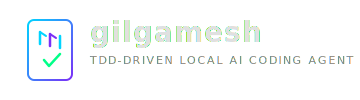

<p align="center">
  
</p>

<p align="center">
  A local AI-powered coding agent that takes a test-driven approach to software engineering.<br/>
  Built for CPU inference with lean token overhead.<br/>
  Part of the <a href="https://github.com/godsfromthemachine">Gods from the Machine</a> project.
</p>

---

## What is this?

Gilgamesh is an interactive CLI agent that connects to a local llama.cpp server (or any OpenAI-compatible endpoint) and provides tool-calling capabilities for software engineering tasks. It's designed to run on CPU with small models (Qwen3.5 2B/4B) by keeping total prompt overhead under ~1,600 tokens.

Features:
- **7 built-in tools**: read, write, edit, bash, grep, glob, test
- **Multi-language testing**: auto-detects Go, Python, Rust, Zig, Node.js projects
- **Configurable tool permissions**: whitelist/blacklist tools per project via config
- **Custom tool registration**: define project-specific tools in `.gilgamesh/tools.json`
- **Streaming SSE**: tokens stream to terminal as they arrive
- **Multi-model profiles**: switch between fast/default/heavy models mid-session
- **Skills system**: 7 built-in skills + reusable prompt templates (`.gilgamesh/skills/*.md`)
- **Hook system**: pre/post tool execution hooks (`.gilgamesh/hooks.json`)
- **Session logging**: JSONL session logs with distill summaries
- **Memory persistence**: project-scoped facts that persist across sessions (`.gilgamesh/memory.json`)
- **Conversation history**: save and resume previous sessions (`/resume`, `/sessions`)
- **Loop detection**: detects and breaks out of repeated tool calls
- **Context compaction**: automatically trims old tool results to stay within context limits
- **Shell completion**: bash, zsh, fish (`gilgamesh completion bash`)
- **TDD-first**: system prompt promotes writing tests before implementation
- **Graceful Ctrl+C**: cancel in-progress requests, double-Ctrl+C force quits
- **Error classification**: network, auth, timeout, LLM errors with recovery hints
- **Markdown rendering**: headers, bold/italic, lists, blockquotes, code blocks with syntax highlighting
- **Context gauge**: visual progress bar showing context pressure (`/status`)
- **Config validation**: startup warnings for invalid endpoints or missing models
- **Environment variable overrides**: GILGAMESH_ACTIVE_MODEL, GILGAMESH_ENDPOINT, etc.
- **Accessible NoColor**: text fallbacks for all Unicode icons when color is disabled

## Quick start

```bash
# Build
go build -o gilgamesh .

# Interactive mode (connects to default model endpoint)
./gilgamesh

# One-shot mode
./gilgamesh run "list all Go files in this directory"

# Use a specific model profile
./gilgamesh -m heavy run "refactor this function"
```

## Configuration

Create `gilgamesh.json` in your project root or `~/.config/gilgamesh/gilgamesh.json`:

```json
{
  "models": {
    "fast": {
      "name": "qwen3.5-2b",
      "endpoint": "http://127.0.0.1:8081/v1",
      "api_key": "sk-local"
    },
    "default": {
      "name": "qwen3.5-2b",
      "endpoint": "http://127.0.0.1:8081/v1",
      "api_key": "sk-local"
    },
    "heavy": {
      "name": "qwen3.5-4b",
      "endpoint": "http://127.0.0.1:8080/v1",
      "api_key": "sk-local"
    }
  },
  "active_model": "default",
  "denied_tools": ["bash"]
}
```

Use `allowed_tools` to whitelist specific tools, or `denied_tools` to blacklist them. If both are set, allowed is applied first, then denied.

For detailed instructions on setting up llama.cpp and local models, see [LOCAL_AI_SETUP.md](LOCAL_AI_SETUP.md).

## Project context

Add a `.gilgameshfile` or `.gilgamesh/context.md` to your project root to inject project-specific context into the system prompt. See [docs/CONTEXT_GUIDE.md](docs/CONTEXT_GUIDE.md) for best practices and examples.

## Skills

Gilgamesh ships with 7 built-in skills available everywhere:

| Skill | Description |
|-------|-------------|
| `/commit` | Stage and commit with descriptive message |
| `/review [file]` | Review code for bugs, style, improvements |
| `/explain [file]` | Explain code or architecture |
| `/fix [issue]` | Write failing test, then fix the bug |
| `/refactor [target]` | Refactor while keeping tests green |
| `/doc [target]` | Generate or update documentation |
| `/tdd [feature]` | Red-green-refactor TDD workflow |

Add custom skills by dropping `.md` files into `.gilgamesh/skills/` (project-local) or `~/.config/gilgamesh/skills/` (global). Project-local skills override built-in skills with the same name. Use `{{args}}` for argument substitution.

```markdown
# Build and test
Build the project and run all tests. {{args}}
```

Invoke with `/skillname` or `/skillname args here`.

## Interactive commands

| Command | Description |
|---------|-------------|
| `/model [fast\|default\|heavy]` | Switch model |
| `/clear` | Reset conversation context |
| `/tokens` | Show estimated context size |
| `/status` | Show model, context gauge, tools, skills, memories |
| `/config` | Show model configuration with all profiles |
| `/skills` | List available skills |
| `/remember <fact>` | Remember a fact across sessions |
| `/forget <n\|text>` | Forget by number or matching text |
| `/memory` | List remembered facts |
| `/resume [path]` | Resume a previous conversation |
| `/sessions` | List recent saved sessions |
| `/session` | Show session log path |
| `/distill [path]` | Summarize a session |
| `/help` | Show all commands |
| `/exit` | Quit |

## MCP Server

Gilgamesh runs as an [MCP](https://modelcontextprotocol.io/) server, exposing its tools to any MCP-compatible client (Claude Desktop, VS Code, other agents) over stdio.

```bash
gilgamesh mcp
```

Configure in Claude Desktop's `claude_desktop_config.json`:

```json
{
  "mcpServers": {
    "gilgamesh": {
      "command": "/path/to/gilgamesh",
      "args": ["mcp"]
    }
  }
}
```

Implements `initialize`, `tools/list`, and `tools/call` via JSON-RPC 2.0 over stdio.

## HTTP API

Run gilgamesh as an HTTP server for programmatic access:

```bash
gilgamesh serve              # default port :7777
gilgamesh serve -p 8888     # custom port
```

| Method | Path | Description |
|--------|------|-------------|
| GET | `/api/health` | Health check |
| GET | `/api/tools` | List all tools with schemas |
| POST | `/api/tools/{name}` | Execute a tool (JSON body = args) |
| POST | `/api/chat` | Agent conversation (SSE streaming) |

```bash
# List tools
curl http://localhost:7777/api/tools

# Execute a tool directly
curl -X POST http://localhost:7777/api/tools/read -d '{"path": "main.go"}'

# Chat with the agent (SSE stream)
curl -N -X POST http://localhost:7777/api/chat -d '{"message": "list all Go files"}'
```

## Environment variables

Override config values without editing `gilgamesh.json`:

| Variable | Description |
|----------|-------------|
| `GILGAMESH_ACTIVE_MODEL` | Override active model profile (fast, default, heavy) |
| `GILGAMESH_ENDPOINT` | Override endpoint URL for the active model |
| `GILGAMESH_API_KEY` | Override API key for the active model |
| `GILGAMESH_MODEL_NAME` | Override model name for the active model |

```bash
GILGAMESH_ACTIVE_MODEL=heavy ./gilgamesh run "complex task"
```

## Benchmarking & Model Trials

Gilgamesh includes a pure Go benchmark suite for trialing local models. It loads profiles from `gilgamesh.json`, optionally integrates with llama-bench for raw inference metrics, and supports JSON output for historical tracking.

```bash
go run ./cmd/bench              # benchmark active profile from config
go run ./cmd/bench -all         # benchmark all profiles with summary table
go run ./cmd/bench -model heavy # benchmark specific profile
go run ./cmd/bench -raw         # include raw llama-bench pp/tg metrics
go run ./cmd/bench -json        # JSON output for scripting
go run ./cmd/bench -save r.json # append results to JSON log file
go run ./cmd/bench -all -raw -save results.json  # full trial run
```

Measures 6 dimensions: health latency, raw inference speed (pp/tg tok/s), minimal prompt, tool call parsing, one-shot agent response, and full edit task quality.

See [TRIALS.md](TRIALS.md) for detailed results and the ongoing quest for the optimal local coding setup. See [docs/TRIAL_METHODOLOGY.md](docs/TRIAL_METHODOLOGY.md) for the controlled trial protocol.

### Key Findings

| Model | PP (tok/s) | TG (tok/s) | First Response | Verdict |
|-------|-----------|-----------|---------------|---------|
| Qwen3.5-2B Q4_K_M | 181 | 19 | ~7s | **Sweet spot** — default |
| Qwen3.5-4B Q4_K_M | 72 | 7.4 | ~20s | Quality ceiling — heavy |
| Qwen3.5-0.8B | — | — | — | Rejected — too unreliable |
| Qwen3.5-9B Q8_0 | 30 | 5.7 | — | Not worth it — same efficiency as 4B, 40-70% slower |

## Architecture

```
gilgamesh/
├── main.go           # CLI entry, REPL, subcommand dispatch
├── agent/
│   ├── agent.go      # Core agent loop + event-based variant
│   └── prompt.go     # System prompt (~300 tokens)
├── llm/
│   └── client.go     # OpenAI-compatible streaming SSE client
├── tools/
│   ├── registry.go   # Tool registration, dispatch, enumeration
│   ├── read.go       # Read file contents
│   ├── write.go      # Write/create files
│   ├── edit.go       # Find-and-replace editing
│   ├── bash.go       # Shell command execution
│   ├── grep.go       # Content search
│   ├── glob.go       # File pattern matching
│   ├── test.go       # Multi-language test runner
│   └── custom.go     # Custom tool loading (.gilgamesh/tools.json)
├── ui/
│   ├── color.go      # Terminal color profile detection (NO_COLOR, CLICOLOR, TTY)
│   ├── style.go      # Semantic ANSI styles + accessible icon functions
│   ├── spinner.go    # Animated progress indicator with elapsed time
│   ├── markdown.go   # Streaming markdown renderer (code blocks, headers, lists)
│   ├── table.go      # Auto-sized columnar table output
│   ├── gauge.go      # Text progress bars with color thresholds
│   ├── errors.go     # Error classification with recovery hints
│   └── command.go    # Slash command registry with category grouping
├── mcp/
│   ├── protocol.go   # JSON-RPC 2.0 + MCP protocol types
│   └── server.go     # MCP stdio server
├── server/
│   └── server.go     # HTTP API server
├── config/           # JSON config loader (model profiles, tool permissions, env overrides)
├── context/          # Project context + skills (7 built-in via go:embed)
├── hooks/            # Pre/post tool execution hooks
├── memory/           # Project-scoped persistent memory
├── session/          # JSONL session logging + conversation history
├── cmd/bench/        # Go model benchmark suite (6-stage pipeline)
└── local-ai/         # (gitignored) llama.cpp binaries + GGUF models
```

## Documentation

| Doc | Description |
|-----|-------------|
| [LOCAL_AI_SETUP.md](LOCAL_AI_SETUP.md) | llama.cpp setup, model downloads, server configuration |
| [docs/CONTEXT_GUIDE.md](docs/CONTEXT_GUIDE.md) | Project context files, custom tools, memory usage |
| [TRIALS.md](TRIALS.md) | Model benchmark results and key findings |
| [docs/TRIAL_METHODOLOGY.md](docs/TRIAL_METHODOLOGY.md) | Controlled trial protocol and reproducibility |

## Token Budget

The critical constraint for CPU inference:

| Component | Tokens |
|-----------|--------|
| System prompt | ~300 |
| 7 tool definitions | ~800 |
| Project context | ~500 (capped) |
| **Total overhead** | **~1,600** |

At ~160 tok/s prompt processing (Qwen3.5-2B Q4_K_M, 12 threads), the first response arrives in ~10 seconds on CPU.

## License

MIT
